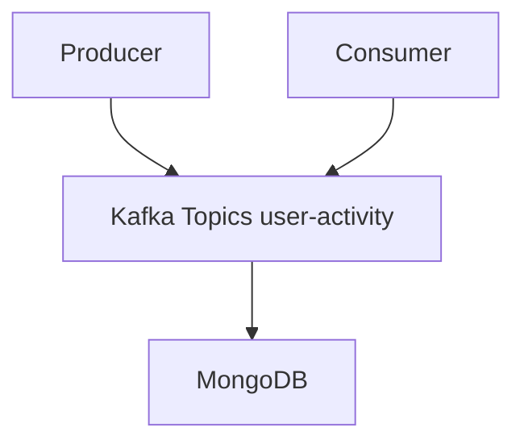

# Activity Logs Proccessing System

This project demonstrate a pipeline for processing **user activity logs** using **Kafka (Kraft mode)**, **Node.js**, and **MongoDB**

## Pipeline


## Features

### Kafka Producer
- Generates user activity logs.
- Sends logs to Kafka topic.

### Kafka Consumer
- Listens to the Kafka topic.
- Processes incoming logs.
- Saves documents to MongoDB

### MongoDB Integration
- stores all activity logs.
- Automatically creates index {userId: 1, timestamp:-1, action:1}

### Dockarized Deployment
- Kafka (KRaft Mode)
- MongoDB
- Node.js app (Producer + Consumer)

## Project Structure
``` bash
├── docker-compose.yml
├── Dockerfile
├── .env
├── package.json
├── package-lock.json
├── README.md
├── restart-docker-compose.sh
└── src
    ├── controllers
    │   └── activityController.js
    ├── index.js
    ├── models
    │   └── Activity.js
    ├── routes.js
    └── services
        ├── activityService.js
        └── kafkaService.js
```

## Running the System
### 1. clone the repository
``` bash
git clone https://github.com/Menna-Eltouny/Kafka_Task.git
cd Kafka_Task

docker-compose up
```

## Technologies Used
- Kafka
- Node.js and Express
- MongoDB
- Docker & Docker-compose
